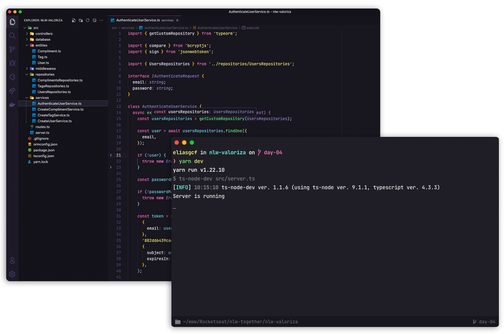

<h1 align="center">Valoriza</h1>

  

  

  

  

## ✨ Tecnologias

Este projeto foi desenvolvido na trilha *Node* da [NLW Together](https://nextlevelweek.com/) com as seguintes tecnologias:

- [Node.js](https://nodejs.org/pt-br/)
- [Typescript](https://www.typescriptlang.org/pt/)
- [Express](https://expressjs.com/pt-br/)
- [JSONWebToken](https://github.com/auth0/node-jsonwebtoken#readme)

## 💻 Projeto

Valoriza é uma plataforma para promover o reconhecimento entre companheiros de equipa.

## 🚀 Como executar

- Clona o repositório
- Executa `yarn` para transferir as dependências
- Executa `yarn typeorm migration:run` para criar as tabelas do banco de dados.
- Executa `yarn dev` para iniciar a aplicação.

Por fim, a aplicação estará disponível em `http://localhost:3000`

## 📄 Licença

Este projeto está sob a licença MIT. Vê o ficheiro [LICENSE](LICENSE.md) para mais detalhes.

---
Feito com 🧡 by Rodrigo na [NLW Together](https://nextlevelweek.com/)
